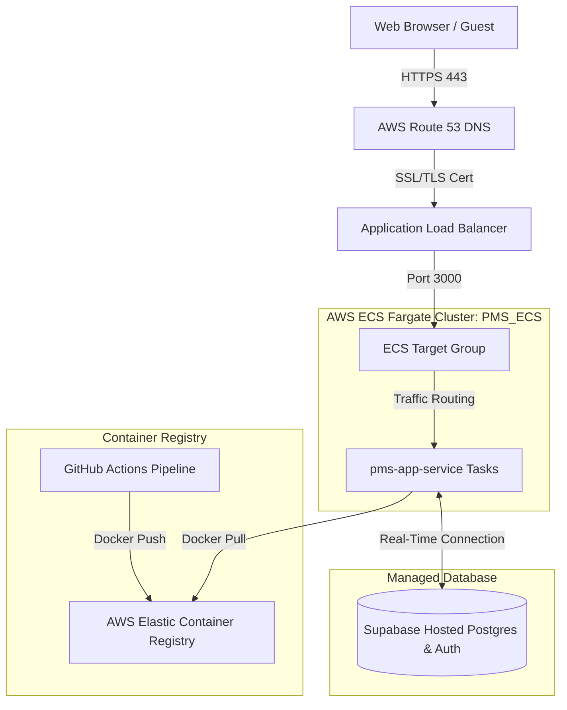

# 🚀 StaySync AWS ECS Deployment Guide

This document serves as the single source of truth for the deployment architecture, tools, and workflows used to host the StaySync PMS platform on AWS.

> [!IMPORTANT]
> **Mandate for Future Updates:**
> Whenever any new AWS services, third-party APIs, database schemas, environment variables, or port configurations are added or modified in the project, **you MUST update this file immediately** to keep our deployment specifications synchronized and prevent deployment drift.

---

## 🏛️ Cloud Architecture Overview

StaySync uses a serverless container architecture hosted on **AWS ECS Fargate** across a secure, multi-Availability Zone (AZ) VPC. 



---

## 🛠️ AWS Services & Tools Used

The following native AWS resources are configured to run StaySync:

| AWS Service | Resource Name / Configuration | Purpose |
| :--- | :--- | :--- |
| **AWS ECS (Fargate)** | Cluster: `PMS_ECS`<br>Service: `pms-app-service` | Runs serverless, auto-healing Docker containers of your Next.js application without server management. |
| **Amazon ECR** | Repository: `401644592968.dkr.ecr.ap-south-1.amazonaws.com/pms/app` | Private Docker image registry storing all production-ready builds. |
| **Application Load Balancer** | `pms-alb` | Receives HTTPS traffic, decrypts SSL certificates, and distributes connections across healthy running tasks. |
| **AWS IAM** | Role: `ecsTaskExecutionRole`<br>Pipeline User: Local AWS Access Keys | Dictates execution permissions for running containers and authorizes the GitHub Actions runner. |
| **Route 53 & ACM** | SSL Certificate (AWS Certificate Manager) | Manages domain DNS routing and serves secure HTTPS traffic. |

### Supporting External Services
* **Supabase:** Managed PostgreSQL database (`njblemtrkqdnijwrnvjp`), real-time GoTrue authentication engine, and user accounts.
* **n8n:** Trigger-based webhook runner dispatching transaction receipts and guest registration emails.

---

## ⚙️ The CI/CD GitOps Pipeline (GitHub Actions)

Your deployment process is fully automated. Whenever code is pushed to the `cloud-beds-pms` branch, GitHub Actions executes **`.github/workflows/deploy.yml`**:

1. **Step 1: Automated Unit Verification**
   * Boots a clean Node.js environment on a virtual runner.
   * Installs dependency trees via `npm ci` and runs Vitest tests.

2. **Step 2: Authenticating with AWS**
   * Uses your stored GitHub Secrets (`AWS_ACCESS_KEY_ID`, `AWS_SECRET_ACCESS_KEY`) to log into your ECR registry.

3. **Step 3: Client-Side Environment Variable Baking**
   * To prevent local variables from leaking into production, the pipeline fetches production credentials (`PROD_SUPABASE_URL`, `PROD_SUPABASE_ANON_KEY`) from GitHub Secrets.
   * It injects them during the compilation stage using `--build-arg` in the `docker build` command.

4. **Step 4: Image Push to ECR**
   * Docker builds the Next.js app, tags it with both `:latest` and the unique `:${{ github.sha }}` commit hash, and pushes them to ECR.

5. **Step 5: Zero-Downtime Rolling Update**
   * The pipeline triggers `aws ecs update-service --force-new-deployment` to trigger a rolling update.
   * AWS launches a new task container first. Once the ALB confirms its stability, it begins routing traffic to it, and gracefully terminates the older task container. **The user experiences absolute zero-downtime.**

---

## 📋 Manual Checklist & Disaster Recovery Workflow

If you ever need to manually deploy or recover the platform from scratch, execute these commands in exact order:

### 1. Database Schema Synchronization
Always update your Supabase database schema *before* building your code so the container compiled bundle references accurate tables:
```bash
npx supabase db push --linked
```
*(Confirms project reference target is `njblemtrkqdnijwrnvjp`)*

### 2. Manual Docker Build & Bake
Ensure production keys are passed to build arguments (replace `<PROD_ANON_KEY>` with your actual production Anon Key):
```bash
docker build --no-cache \
  --build-arg NEXT_PUBLIC_SUPABASE_URL=https://njblemtrkqdnijwrnvjp.supabase.co \
  --build-arg NEXT_PUBLIC_SUPABASE_ANON_KEY=<PROD_ANON_KEY> \
  -t 401644592968.dkr.ecr.ap-south-1.amazonaws.com/pms/app:latest .
```

### 3. Push Build to Amazon ECR
```bash
docker push 401644592968.dkr.ecr.ap-south-1.amazonaws.com/pms/app:latest
```

### 4. Force ECS Rolling Service Deployment
```bash
aws ecs update-service \
  --cluster PMS_ECS \
  --service pms-app-service \
  --force-new-deployment \
  --region ap-south-1
```

---

## 🛡️ Forbidden Actions
* ❌ **NEVER** build your production Docker image using local `.env.local` context without passing production keys via `--build-arg`.
* ❌ **NEVER** modify passwords, schemas, or roles in production using direct raw SQL `UPDATE auth.users` commands. Always use the Supabase Auth Admin API or the dashboard.
* ❌ **NEVER** delete AWS ECR tags tagged with historical commit hashes, as they are crucial for instant rolling rollback recovery if a bug occurs.
