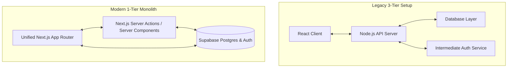
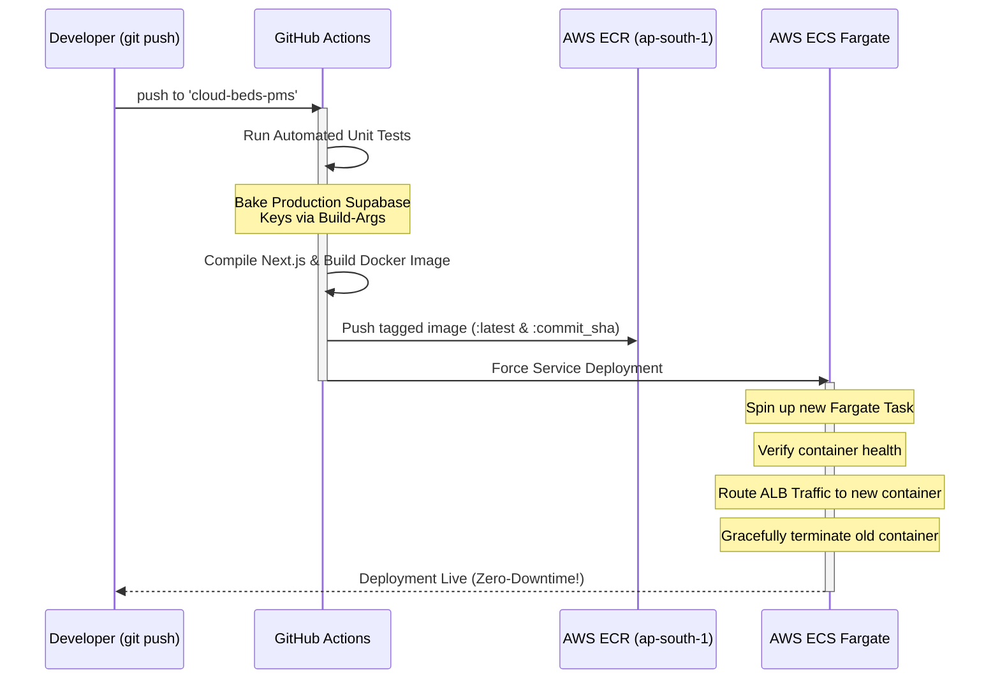

# 🏨 StaySync Property Management System (PMS)

StaySync is a modern, high-performance, and cloud-native Property Management System (PMS) designed for boutique hotels, guest houses, and properties. It streamlines real-time room availability, front desk operations, housekeeping workflows, shift cash handovers, and guest automations in a unified interface.

---

## 🏗️ Architectural Evolution: Moving from 3-Tier to 1-Tier

Recently, the StaySync platform underwent a major architectural modernization. We migrated from a legacy 3-Tier microservices structure to a highly optimized, bulletproof **1-Tier Unified Monolithic Architecture**.



### The Legacy 3-Tier Model (Deprecated)
* **Structure:** Separated React SPA client, an Express/Node.js API gateway backend, separate session/auth middleware servers, and a PostgreSQL database.
* **Drawbacks:** High latency (double network hops for simple requests), complex custom middleware synchronization, brittle state management across API layers, and heavy DevOps overhead maintaining multiple containers.

### The Modern 1-Tier Monolithic Model (Current)
* **Structure:** Consolidating client and server layers into **Next.js (App Router) with direct Supabase Database and GoTrue Auth bindings**.
* **Key Improvements:**
  * **Direct Secure Queries:** Next.js Server Components and Server Actions fetch data directly from Supabase, removing the need for a separate middleware API gateway.
  * **Database-Level RLS & Security:** Leveraging Supabase **Row-Level Security (RLS)**. The client queries the database securely; Postgres itself guarantees that a user can only see or edit records belonging to their own property.
  * **Single Workspace Model:** Designed around a role-free workspace model. Your account is your workspace—eliminating complex administrative gates and synchronization lag.
  * **Atomicity & Real-Time Sync:** Room bookings, folio charges, and ledger payments operate under strict database transaction atomicity.

---

## ⚡ Real-Time Automation & n8n

StaySync includes a deeply embedded automation engine to handle asynchronous guest communication:
* **Workflow:** When a new booking is created on the Operational Terminal, a PostgreSQL Database Trigger (`AFTER INSERT`) fires an HTTP webhook payload.
* **Processor:** A local **n8n container** intercepts the webhook, parses the guest and booking metadata, and invokes the **Resend API** to dispatch highly personalized HTML Welcome Letters and digital registration cards to the guest.

---

## ☁️ Cloud Infrastructure: Migrating from AWS EKS to AWS ECS Fargate

Along with the codebase, our cloud deployment was simplified and hardened to remove unnecessary overhead:

### 1. The Migration (EKS ➡️ ECS Fargate)
* **Before:** The system ran on **AWS EKS (Elastic Kubernetes Service)**. This required massive overhead, including managing an ALB Ingress Controller, custom OIDC provider certificates, Route53 external-dns scripts, custom cluster IAM policies, and multiple YAML manifests for deployments/services.
* **Now:** The system runs completely serverless on **AWS ECS Fargate**. AWS manages the physical server orchestration, auto-scaling, and health checks under a standard Elastic Load Balancer (ALB). 
* **Benefits:** 
  * Replaced dozens of complex Kubernetes and IAM policy files with a clean container definition.
  * Reduced cloud computing costs significantly.
  * Built-in, fully managed container health routing.

### 2. CI/CD GitOps Pipeline (GitHub Actions)
Our automated pipeline (`.github/workflows/deploy.yml`) handles everything on a single `git push` event:



* **Client-Side Secret Baking:** The pipeline extracts AWS credentials and production Supabase keys (`NEXT_PUBLIC_SUPABASE_URL`, `NEXT_PUBLIC_SUPABASE_ANON_KEY`) from **GitHub Secrets** and bakes them securely into the Next.js static build using Docker build arguments.
* **Rolling Update Rollout:** Uses the `--force-new-deployment` directive to boot up new container tasks, waits for the ALB to confirm their stability, shifts guest traffic seamlessly, and then scales down old containers—achieving **absolute zero-downtime**.

---

## 🚀 Directory Structure Overview

Following our workspace organization, the project is organized as follows:

```bash
├── .github/workflows/    # Automated CI/CD pipeline (deploy.yml)
├── public/               # Static assets, branding logo, and vector graphics
├── scripts/              # Consolidated database seeds, administrative tools, and test suites
│   ├── create-superadmin.mjs     # Generates primary administrator login
│   ├── delete_unused_users.js    # Database sanitization utility
│   ├── fix-password.mjs          # Remote password reset tool
│   ├── replicate_prod_to_local.js# Synchronizes production Supabase structure to local
│   └── eslint.config.mjs         # Static analysis config
├── src/
│   ├── app/              # Next.js App Router (Dashboard pages, login, and setups)
│   │   ├── dashboard/
│   │   │   ├── front-office/  # Real-time front desk, guest billing, and ledger page
│   │   │   ├── night-audit/   # Daily close audits and revenue verification
│   │   │   └── property-setup/# Property details, rooms config, and setup wizard
│   └── components/       # Premium UI components (modals, grids, tape charts)
├── supabase/
│   ├── migrations/       # SQL database migrations
│   └── dumps/            # Structured SQL schema and localized data backups
├── Dockerfile            # Multi-stage production container instructions
├── GEMINI.md             # Foundational deployment rules and Supabase configurations
└── package.json          # Dependency packages and execution scripts
```

---

## 💻 Local Development Setup

To boot up StaySync PMS on your local workstation:

1. **Install dependencies:**
   ```bash
   npm install
   ```

2. **Set up local environment variables (`.env.local`):**
   ```env
   NEXT_PUBLIC_SUPABASE_URL=your_local_supabase_url
   NEXT_PUBLIC_SUPABASE_ANON_KEY=your_local_supabase_anon_key
   ```

3. **Spin up the development server:**
   ```bash
   npm run dev
   ```
   Open `http://localhost:3000` on your browser to access your local operational workspace.
