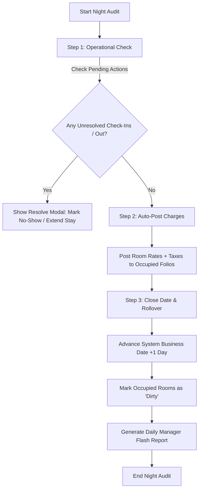

# 🌙 StaySync Night Audit: Feature Analysis & Architecture

This document outlines the analysis of standard property management system (PMS) "Night Audit" workflows and defines a simplified, lightweight, and robust design customized for StaySync.

---

## 🏢 What is a Night Audit?

In the hospitality industry, a **Night Audit** is a daily operational and financial process executed at the end of the day (typically between 12:00 AM and 4:00 AM). Its core goals are:
1. **Reconciliation**: Balancing all financial transactions, guest ledgers, and department balances of the day.
2. **Auto-posting**: Automatically posting the daily room charges and taxes to all active/occupied guest folios.
3. **Rollover**: Officially closing the current business date and advancing the PMS system's active business date to the next calendar day.

---

## 📊 Industry Reference: How Other PMS Platforms Handle It

| PMS Platform | Complexity | Main Focus | Handling Gaps |
| :--- | :--- | :--- | :--- |
| **Opera Cloud** | 🔴 Extremely High | Strict accounting ledgers, fiscal compliance, massive configuration. | Will lock the entire system; requires all cashier shifts to be closed manually first. |
| **Mews** | 🟡 Medium-High | Automated, asynchronous background rollover, cloud-native. | Requires automatic credit card charges to be settled before date change. |
| **Cloudbeds** | 🟢 Medium | Operational check-list focused, friendly for boutique hotels. | Visual indicators for pending check-ins/check-outs, clean manual rollover wizard. |

---

## 💡 Our Approach for StaySync: Simple, Elegant, Operational

A heavy, enterprise-grade accounting system is not needed. For **StaySync**, we will design a highly visual, **3-Step Night Audit Wizard** that keeps hotel operations smooth without locking down database rows unnecessarily.



### 📋 Detailed Three-Step Workflow

#### 1. Step 1: Operational Checklist (Unresolved Reservations)
The system checks for and displays:
* **Pending Check-ins**: Guests scheduled to arrive today who haven't checked in.
  * *Actions permitted:* Mark as **No-Show** (with optional fee) or **Change Arrival Date** (keep as reserved).
* **Pending Check-outs**: Guests scheduled to depart today who haven't checked out.
  * *Actions permitted:* **Check-Out** now or **Extend Stay** (add 1 or more nights).

#### 2. Step 2: Auto-Post Room Charges & Taxes
Once the checklist is resolved, the system calculates and posts charges for all rooms currently in `Checked-In` status:
* **Calculates**: `Room Base Rate` + `Tax Rate (e.g. 12%)` = `Total Daily Cost`.
* **Posts**: Appends a new itemized transaction line-item to each active guest's **Folio/Invoice** under the transaction category "Daily Room Charge".

#### 3. Step 3: Date Rollover & Housekeeping Sync
The final step closes the day:
* **System Business Date**: Increments the database configuration value `pms_business_date` by **+1 day**. (Our system relies on this business date rather than the server's local date for posting transactions).
* **Housekeeping Status**: All occupied rooms have their status updated from `Clean` or `Inspected` to **`Dirty`** (since guests slept in them overnight).
* **Reports**: Saves a static snapshot of the day's revenue, occupancy rate, and active guest ledger for historical tracking.

---

## 🛠️ DB Schema Additions (Simple)

To support this feature, we need to track the active business date and transaction postings.

### 1. System Configuration Table (`pms_settings`)
Tracks the operational date of the hotel.
```sql
CREATE TABLE pms_settings (
  key TEXT PRIMARY KEY,
  value TEXT NOT NULL,
  updated_at TIMESTAMP DEFAULT NOW()
);

-- Initial Seed
INSERT INTO pms_settings (key, value) VALUES ('business_date', '2026-06-20');
```

### 2. Room Charges Table (`folio_transactions`)
Tracks postings.
```sql
CREATE TABLE folio_transactions (
  id UUID PRIMARY KEY DEFAULT gen_random_uuid(),
  booking_id UUID REFERENCES bookings(id),
  amount DECIMAL(10,2) NOT NULL,
  description TEXT NOT NULL, -- e.g. "Room Charge - 2026-06-20"
  type TEXT NOT NULL, -- "CHARGE" or "PAYMENT"
  created_at TIMESTAMP DEFAULT NOW()
);
```

---

## 🧪 Let's Build and Test Locally Next!

We will build a simple, premium React/Next.js dashboard page under `/dashboard/night-audit` containing:
1. **A Header Section** showing the Current Business Date and a beautiful "Run Night Audit" action button.
2. **Visual Step Wizard**: Showing tabs for **Pending Arrivals**, **Pending Departures**, **Posting Room Charges**, and **Final Rollover**.
3. **Database Integration**: Simulating/executing real SQL updates in Supabase (updating dates, creating transactions, and modifying room states).
